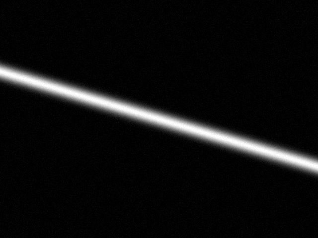
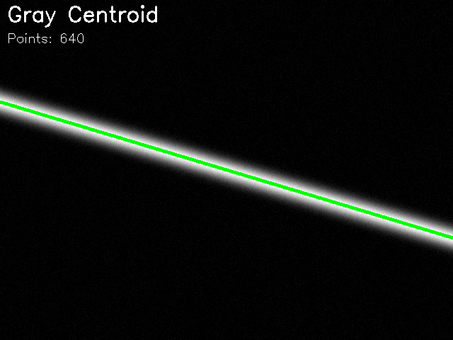

# 激光中心线检测软件

一个功能完整的激光条纹中心线检测软件，基于 Python 和 PyQt5 开发，提供友好的图形界面和多种检测算法。

## 效果演示

### 原始激光条纹图像


### 检测结果（灰度重心法）


*绿色线条为检测到的激光中心线，成功检测到 640 个坐标点*

## 功能特点

### 核心功能
- **图像加载**: 支持 JPG, PNG, BMP, TIFF 等常见图像格式
- **图像预处理**: 
  - 自动灰度化处理
  - 可调节的高斯滤波降噪
  - 阈值分割功能
- **多种检测算法**:
  - **灰度重心法**: 计算每列像素灰度值的加权平均位置，适用于大部分激光条纹
  - **高斯拟合法**: 对每列像素灰度分布进行高斯曲线拟合，精度更高
  - **极值法**: 取每列最大灰度值位置，处理速度最快
- **结果可视化**: 在原图上叠加显示检测到的中心线
- **数据导出**: 将中心线坐标导出为 CSV 文件，方便后续分析

### 界面特点
- 直观的图形化用户界面
- 实时参数调节
- 并排图像对比显示
- 表格形式展示坐标数据
- 完整的菜单栏和状态栏

## 安装说明

### 环境要求
- Python 3.7 或更高版本
- 操作系统: Windows / Linux / macOS

### 安装步骤

1. **克隆或下载本项目**
   ```bash
   git clone <repository_url>
   cd laser_centerline_detection
   ```

2. **安装依赖包**
   ```bash
   pip install -r requirements.txt
   ```

   或者手动安装：
   ```bash
   pip install PyQt5 opencv-python numpy scipy pandas matplotlib
   ```

3. **验证安装**
   ```bash
   python test_installation.py
   ```
   
   如果看到 "🎉 所有测试通过！" 说明安装成功。

## 使用说明

### 快速开始

查看 [快速入门指南](QUICKSTART.md) 获取详细的入门教程。

### 启动软件

在项目根目录下运行：
```bash
python main.py
```

或者从 laser_centerline_detection 目录运行：
```bash
cd laser_centerline_detection
python main.py
```

### 基本操作流程

1. **加载图像**
   - 点击菜单栏 "文件" → "打开图像"
   - 或使用快捷键 `Ctrl+O`
   - 选择要处理的激光条纹图像

2. **调整预处理参数**
   - 使用 "高斯滤波核大小" 滑块调整降噪强度（建议值: 3-7）
   - 使用 "二值化阈值" 滑块调整阈值（可选）
   - 点击 "应用滤波" 按钮应用预处理

3. **选择检测算法**
   - 在 "检测算法" 下拉框中选择合适的算法
   - **灰度重心法**: 适用于大多数情况，速度较快
   - **高斯拟合法**: 精度最高，但计算较慢
   - **极值法**: 速度最快，适用于清晰的激光条纹

4. **检测中心线**
   - 点击 "检测中心线" 按钮
   - 检测结果将显示在 "检测结果" 区域
   - 中心线坐标数据显示在右侧表格中

5. **保存和导出**
   - 保存结果图像: "文件" → "保存结果图像" (Ctrl+S)
   - 导出坐标数据: "文件" → "导出数据" (Ctrl+E)
   - 数据将以 CSV 格式保存，包含 X 坐标和 Y 坐标

6. **重置**
   - 点击 "重置图像" 按钮可恢复到加载后的初始状态

## 算法说明

### 1. 灰度重心法 (Gray Centroid Method)

**原理**: 
- 对图像的每一列，计算像素灰度值的加权平均位置
- 公式: `y_center = Σ(I(y) * y) / ΣI(y)`
- 其中 I(y) 是像素点的灰度值

**优点**:
- 抗噪能力强
- 适用于各种宽度的激光条纹
- 计算速度较快

**适用场景**: 
- 一般激光条纹检测
- 条纹宽度变化的场景

### 2. 高斯拟合法 (Gaussian Fitting Method)

**原理**:
- 假设激光条纹的灰度分布符合高斯分布
- 对每列像素的灰度分布进行高斯曲线拟合
- 提取拟合曲线的峰值位置作为中心线

**优点**:
- 精度最高
- 能够处理噪声干扰
- 适合精密测量

**适用场景**:
- 高精度测量需求
- 激光条纹质量较好的场景

### 3. 极值法 (Maximum Value Method)

**原理**:
- 取每列像素中灰度值最大的点作为中心点

**优点**:
- 计算速度最快
- 实现简单

**适用场景**:
- 激光条纹清晰、对比度高的场景
- 实时性要求高的应用

## 项目结构

```
laser_centerline_detection/
├── README.md                # 项目说明文档
├── requirements.txt         # 依赖包列表
├── main.py                  # 程序入口
├── __init__.py             # 包初始化文件
├── gui/                     # GUI界面模块
│   ├── __init__.py
│   ├── main_window.py      # 主窗口实现
│   └── widgets.py          # 自定义控件
├── core/                    # 核心功能模块
│   ├── __init__.py
│   ├── image_processor.py  # 图像预处理
│   ├── centerline_detector.py  # 中心线检测算法
│   └── data_exporter.py    # 数据导出
├── utils/                   # 工具函数
│   ├── __init__.py
│   └── helpers.py          # 辅助函数
└── sample_images/          # 示例图像目录
    ├── README.md
    ├── test_laser_stripe.png      # 测试图像
    └── result_*.png               # 检测结果示例
```

## 示例和测试

### 测试安装
运行测试脚本验证所有功能：
```bash
python test_installation.py
```

### 编程示例
查看如何在代码中使用本软件的模块：
```bash
python example_usage.py
```

示例代码展示了：
- 如何加载和预处理图像
- 如何使用三种不同的检测算法
- 如何保存结果和导出数据
- 如何进行数据分析

### 简单示例代码
```python
from laser_centerline_detection.core import ImageProcessor, CenterlineDetector

# 加载图像
processor = ImageProcessor()
processor.load_image("your_laser_image.png")

# 检测中心线
detector = CenterlineDetector()
points = detector.detect(
    processor.get_image('gray'), 
    CenterlineDetector.METHOD_GRAY_CENTROID
)

# 导出结果
from laser_centerline_detection.core import DataExporter
exporter = DataExporter()
exporter.export_to_csv(points, "output.csv")
```

## 开发说明

### 代码规范
- 使用 UTF-8 编码
- 遵循 PEP 8 代码规范
- 注释使用中文
- 类和函数都包含文档字符串

### 扩展开发

如需添加新的检测算法：

1. 在 `core/centerline_detector.py` 中添加新方法
2. 在 `CenterlineDetector` 类中添加算法常量
3. 在 `detect` 方法中添加算法分支
4. 在 GUI 的算法选择下拉框中添加新选项

### 自定义修改

- **修改界面样式**: 编辑 `gui/main_window.py` 中的样式表
- **调整检测参数**: 修改 `core/centerline_detector.py` 中的阈值和参数
- **添加新的图像处理方法**: 在 `core/image_processor.py` 中扩展

## 常见问题

### Q1: 检测不到中心线怎么办？
**A**: 
- 确保图像中有明显的激光条纹
- 尝试调整高斯滤波参数
- 更换不同的检测算法
- 检查图像对比度是否足够

### Q2: 检测结果不准确？
**A**:
- 使用高斯拟合法提高精度
- 调整高斯滤波核大小，降低噪声影响
- 确保激光条纹清晰、连续

### Q3: 软件运行缓慢？
**A**:
- 使用极值法或灰度重心法
- 减小图像尺寸
- 优化图像预处理参数

### Q4: 无法保存结果？
**A**:
- 确保有写入权限
- 检查文件路径是否有效
- 确保已经完成中心线检测

## 技术支持

如有问题或建议，请通过以下方式联系：
- 提交 Issue
- 发送邮件
- 查看项目文档

## 许可证

本项目采用 MIT 许可证。详见 LICENSE 文件。

## 更新日志

### v1.0.0 (当前版本)
- 初始版本发布
- 实现三种中心线检测算法
- 完整的 GUI 界面
- 数据导出功能
- 中文界面和文档

## 贡献

欢迎贡献代码、报告问题或提出改进建议！

---

**注意**: 本软件仅供学习和研究使用。在实际工程应用中，请根据具体需求进行调整和优化。
